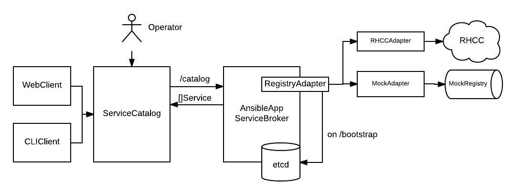

# Ansible Service Broker Design

An [OpenServiceBroker](https://github.com/openservicebrokerapi/servicebroker) (OSB) implementation.

> The [ServiceCatalog] is the source of truth for service instances and bindings.
> Service brokers are expected to have successfully provisioned all the instances
> and bindings ServiceCatalog knows about, and none that it doesn't.

---

---

### Definitions

* **Ansible App (AA)**: Containerized application implementing Ansible App spec (forthcoming)
to be deployed and managed via the Service Broker.

* **Ansible Service Broker (ASB)**: Responsible for AA lifecycle management as well as exposure
of available AAs found in backing registries.

* **Ansible App Registry (ASR)**: Container registry of AAs implementing the
Registry API (forthcoming). Requirements:

  1.) Registry must allow the ASB to query for available AAs, and filter containers that are not AAs.

  2.) ASB must be able to retrieve full set of Spec Files representing the AAs available *without*
      having to pull the full images.

* **Ansible App Spec File**: Metadata file packaged within an AA containing required set of
attributes to make it available via the Service Catalog.

### Guiding principles

* Delegate specifics to AAs when appropriate. AAs define what
`bind` or `provision` mean in the context of their domain.

* Shared behavior between apps should be pushed into AA execution environment,
or the ServiceBroker.

### Flow

**Pre-broker install**

It's possible to have registries containing ~15k AAs. On ASB's installation,
`/catalog` will be called by the Service Catalog, and the ASB needs to respond with
the inventory of known spec files in the form of Service objects (defined by OSB spec).

Shouldn't be done at installation; ASB needs to be bootstrapped so spec files
can be downloaded and cached in a store prior to installation.

> TODO: Upgrades? Cache misses? L1 vs L2?

`POST /bootstrap` loads apps from registry into local store.

Spec includes:

* Bindable?

* Async? Required, Optional, Unsupported

* Parameters - Schema representing configuration params available to user

**Install/Catalog**

ASB pulls inventory of spec files from local store, converts to []Service, sends to Service Catalog

Note: Parameter handling is still a [topic of discussion](https://github.com/openservicebrokerapi/servicebroker/pull/74)
Configurable parameters for an AA should be defined within the spec file. Param
schema is passed to the Service Catalog via the `/catalog` response as metadata.
Purpose of this is to inform Catalog Clients of the configuration parameters that
can be set by a user at provision time.

> TODO: Discussion re: pagination? How does the /catalog handle large amounts of data? [RFC](#)

**Provision**

User provides parameter configuration, which is passed back to the ASB by
the Service Catalog in the form of `parameters` during a provision call.

provision == `PUT /v2/service_instances/:instance_id`

Because the Service Catalog is the source of truth for service instances and bindings,
it provides the ASB with an ID for a desired service instance. The ASB is responsible
for whatever bookkeeping is necessary to make sure it can perform the requested operations
when given this ID. Likely needs to be some kind of GUID.

Puts a record of the instance in its store with whatever bookkeeping
data is required, then tells the relevant AA to `provision` itself with the
user provided parameters given to the ASB via the provision request. AA is responsible
for actually instantiating itself and defining what it means to be `provisioned`.

**Deprovision**

delete == `DELETE /v2/service_instances/:instance_id`

Service Catalog will request a deprovision, ASB must lookout the instances that
it knows about within its data store, will probably extract some about of
parameters as to how that was originally provisioned, and run the AA `deprovision`
action with some amount of parameters as arguments. AA is responsible for taking
itself down.

> TODO: What to do about outstanding bindings? [RFC](#)

**Bind**

> TODO

**Unbind**

> TODO
