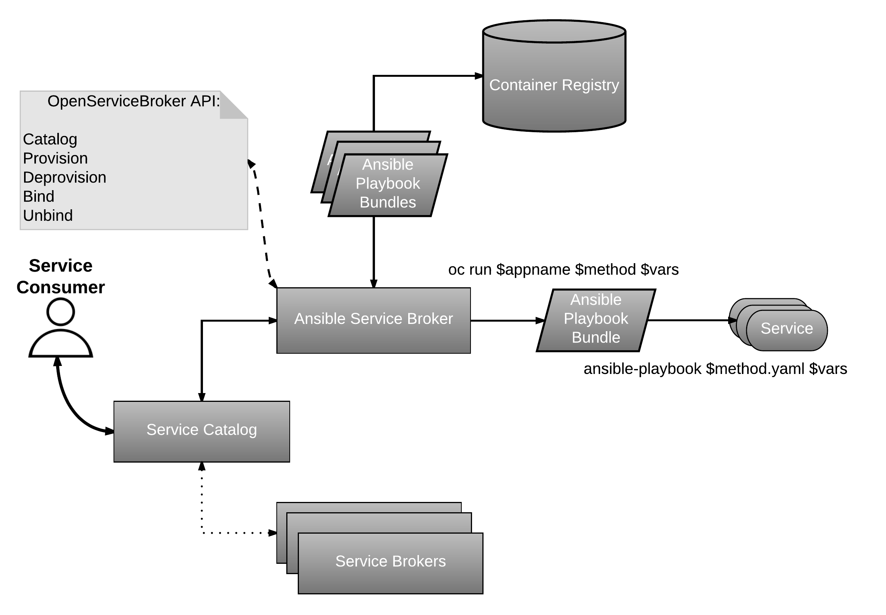

# Introducing Ansible Service Broker for OpenShift and Ansible Playbook Bundles (APB)

## Ansible Service Broker
In December 2016 CloudFoundry [announced](https://www.cloudfoundry.org/open-service-broker-api-launches-as-industry-standard/)
the open sourcing of its service broker APIs, [Open Service Broker API](https://www.openservicebrokerapi.org/).
The Open Service Broker API defines methods for creating a broker, an entity responsible for delivering
applications or services to a cloud platform. The Ansible Service Broker is a specialized broker created
for OpenShift to manage Ansible Playbook Bundles.

## Ansible Playbook Bundle
Ansible Playbook Bundle (APB) is a new method for defining and distributing container applications in OpenShift.
It will leverage Ansible to create a standard path for transitioning from easy to complex deployments. Imagine
you install a prepackaged application on your cluster and then learn you need to customize the deployment to
make it production ready. What if you could peel back the cover in a sense and tweak the packaged files to
satisfy your needs?  Ansible Playbook Bundle is designed to make this transition from simple to complex workflows
possible.

## Service Catalog
Users will interact with the [Service Catalog](https://github.com/kubernetes-incubator/service-catalog)
to obtain a list of available applications and invoke operations for provisioning, deprovisioning, binding, and unbinding
to an application. The Service Catalog will rely on a collection of brokers to handle details associated with
its applications.

The diagram below illustrates a high level concept of the workflow.

## Workflow

  1. User requests list of available applications from the Service Catalog
  2. Service Catalog asks the Ansible Service Broker for available applications
  3. Ansible Service Broker talks to a container registry to learn which APBs are available
  4. User issues a command to provision a specific APB
  5. Provision request makes its way to the Ansible Service Broker which fulfills the command by invoking the
      provision method on the APB
